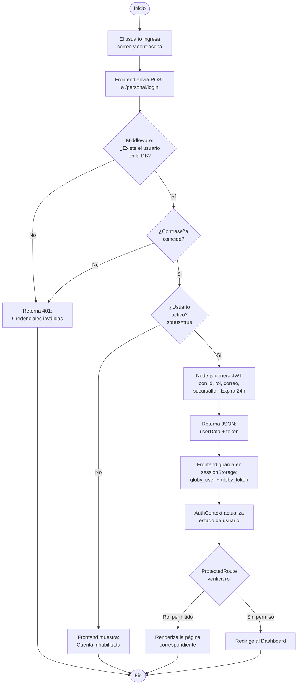
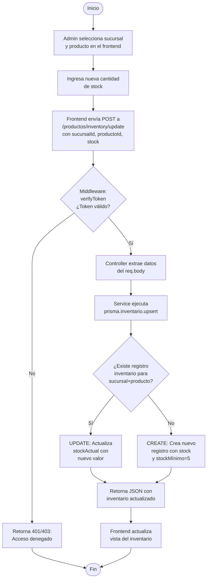
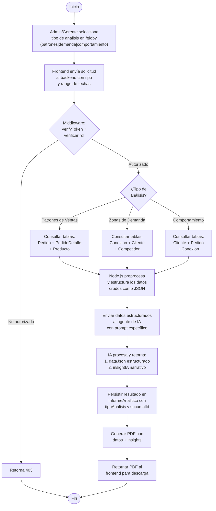
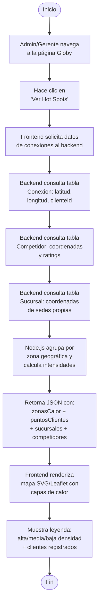
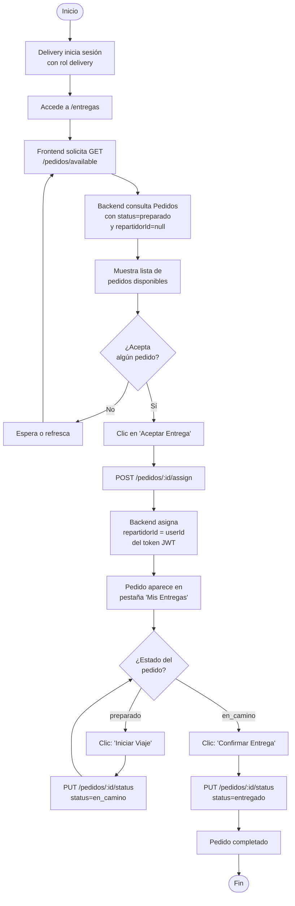
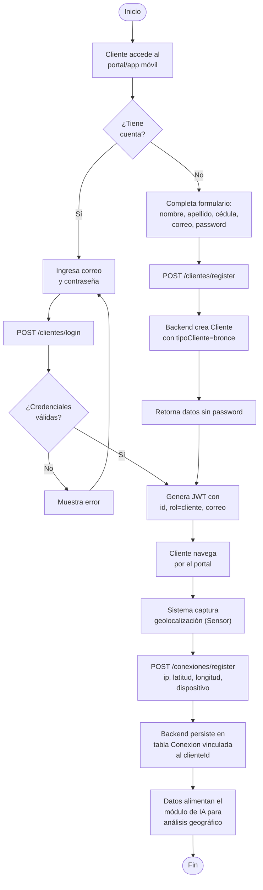
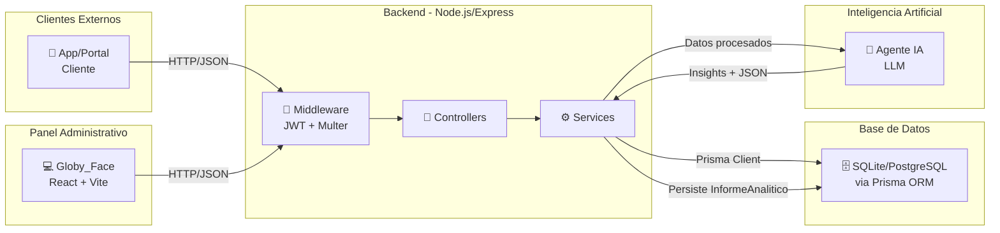
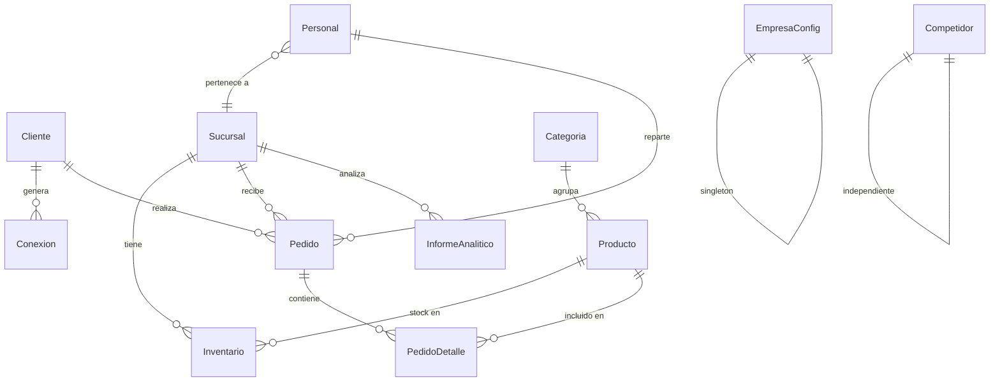

# 📋 Análisis Funcional del Sistema Globy
## Diagramas de Caso de Uso y Diagramas de Actividades

---

## 1. ¿Quiénes usarán el sistema? (Actores)

El sistema Globy define **5 actores** según el schema de base de datos (`PersonalRol`) y el modelo `Cliente`:

| Actor | Rol en el sistema | Acceso actual | Módulos pendientes |
|---|---|---|---|
| **Administrador** (`admin`) | Control total del sistema. Gestiona personal, sucursales, productos, configuración y accede al módulo de IA (Globy). | ✅ Implementado | — |
| **Gerente** (`gerente`) | Supervisión operativa. Ve estadísticas, clientes, ventas, entregas y accede al módulo de IA. | ✅ Implementado | — |
| **Trabajador** (`trabajador`) | Operaciones diarias: gestión de ventas/pedidos y visualización de productos. | ⚠️ Parcial (frontend existe, backend de pedidos vacío) | Módulo de Trabajador |
| **Delivery** (`delivery`) | Gestión de entregas: acepta pedidos, actualiza estados de envío. | ⚠️ Parcial (frontend existe, backend de pedidos vacío) | — |
| **Cliente** | Usuario final externo. Se registra, inicia sesión, realiza pedidos, genera datos de geolocalización. | ⚠️ Parcial (backend CRUD listo, falta frontend) | Módulo de Cliente (app/portal) |

> [!IMPORTANT]
> Los módulos de **Cliente** (portal/app de compras) y **Trabajador** (gestión de pedidos en punto de venta) están pendientes. Los controladores `CompraControllers.ts`, `CompraDetalleControllers.ts`, `ConexionControllers.ts`, `AnalisisControllers.ts` e `InventarioControllers.ts` están **vacíos**.

### Permisos por Página (Frontend actual)

| Página | admin | gerente | trabajador | delivery |
|---|:---:|:---:|:---:|:---:|
| Dashboard | ✅ | ✅ | ✅ | ✅ |
| Productos | ✅ | ✅ | ✅ | ✅ |
| Ventas | ✅ | ✅ | ✅ | ❌ |
| Clientes | ✅ | ✅ | ❌ | ❌ |
| Estadísticas | ✅ | ✅ | ❌ | ❌ |
| Globy (IA) | ✅ | ✅ | ❌ | ❌ |
| Configuración | ✅ | ❌ | ❌ | ❌ |
| Usuarios | ✅ | ❌ | ❌ | ❌ |
| Entregas | ✅ | ✅ | ❌ | ✅ |
| Notificaciones | ✅ | ✅ | ✅ | ✅ |

---

## 2. ¿Cuáles son las tareas principales? (Casos de Uso)

### Diagrama General de Casos de Uso

```mermaid
graph LR
    subgraph Actores
        ADM["🔑 Administrador"]
        GER["📊 Gerente"]
        TRB["🛒 Trabajador"]
        DEL["🚚 Delivery"]
        CLI["👤 Cliente"]
    end

    subgraph "Módulo: Autenticación"
        UC01["CU-01: Iniciar Sesión<br/>(Personal)"]
        UC02["CU-02: Iniciar Sesión<br/>(Cliente)"]
        UC03["CU-03: Registrar Cliente"]
    end

    subgraph "Módulo: Gestión de Sucursales"
        UC04["CU-04: Crear Sucursal"]
        UC05["CU-05: Listar Sucursales"]
        UC06["CU-06: Editar Sucursal"]
        UC07["CU-07: Ver Detalle Sucursal"]
    end

    subgraph "Módulo: Productos e Inventario"
        UC08["CU-08: Crear Producto"]
        UC09["CU-09: Listar Productos"]
        UC10["CU-10: Editar Producto"]
        UC11["CU-11: Consultar Inventario<br/>por Sucursal"]
        UC12["CU-12: Actualizar Stock"]
        UC13["CU-13: Ver Categorías"]
    end

    subgraph "Módulo: Gestión de Personal"
        UC14["CU-14: Registrar Personal"]
        UC15["CU-15: Listar Personal"]
        UC16["CU-16: Editar Personal"]
    end

    subgraph "Módulo: Clientes"
        UC17["CU-17: Ver Datos Cliente"]
        UC18["CU-18: Editar Perfil Cliente"]
    end

    subgraph "Módulo: Pedidos y Entregas"
        UC19["CU-19: Realizar Pedido"]
        UC20["CU-20: Ver Pedidos Disponibles"]
        UC21["CU-21: Aceptar Entrega"]
        UC22["CU-22: Actualizar Estado Pedido"]
    end

    subgraph "Módulo: Análisis con IA (Globy)"
        UC23["CU-23: Generar Reporte<br/>Patrones de Ventas"]
        UC24["CU-24: Generar Reporte<br/>Zonas de Demanda"]
        UC25["CU-25: Generar Reporte<br/>Comportamiento"]
        UC26["CU-26: Ver Hot Spots<br/>(Mapa de Calor)"]
        UC27["CU-27: Descargar Reporte PDF"]
    end

    subgraph "Módulo: Configuración"
        UC28["CU-28: Configurar Empresa"]
        UC29["CU-29: Subir Logo"]
    end

    ADM --- UC01 & UC04 & UC05 & UC06 & UC07
    ADM --- UC08 & UC09 & UC10 & UC11 & UC12 & UC13
    ADM --- UC14 & UC15 & UC16
    ADM --- UC23 & UC24 & UC25 & UC26 & UC27
    ADM --- UC28 & UC29

    GER --- UC01 & UC05 & UC07
    GER --- UC09 & UC11 & UC13
    GER --- UC15
    GER --- UC17
    GER --- UC23 & UC24 & UC25 & UC26 & UC27

    TRB --- UC01 & UC09 & UC19

    DEL --- UC01 & UC20 & UC21 & UC22

    CLI --- UC02 & UC03 & UC18 & UC19
```

---

### Descripción Detallada de Casos de Uso

#### 📦 Módulo: Autenticación y Acceso

| ID | Caso de Uso | Actor(es) | Precondición | Flujo Principal | Postcondición |
|---|---|---|---|---|---|
| CU-01 | Iniciar Sesión (Personal) | Admin, Gerente, Trabajador, Delivery | Tener cuenta registrada | 1. Ingresa correo y contraseña → 2. Sistema valida credenciales → 3. Genera JWT (24h) → 4. Redirige según rol | Usuario autenticado con token |
| CU-02 | Iniciar Sesión (Cliente) | Cliente | Tener cuenta registrada | 1. Ingresa correo y contraseña → 2. Valida → 3. JWT → 4. Acceso al portal | Cliente autenticado |
| CU-03 | Registrar Cliente | Cliente | Ninguna | 1. Completa formulario (nombre, apellido, cédula, correo, password) → 2. Sistema valida unicidad → 3. Crea registro | Cuenta creada, tipo "bronce" |

#### 🏢 Módulo: Gestión de Sucursales

| ID | Caso de Uso | Actor(es) | Flujo Principal |
|---|---|---|---|
| CU-04 | Crear Sucursal | Admin | Ingresa nombre, ciudad, dirección, coordenadas (lat/lng), tipo → Sistema crea registro |
| CU-05 | Listar Sucursales | Admin, Gerente | Sistema consulta todas las sucursales con conteo de personal e inventarios |
| CU-06 | Editar Sucursal | Admin | Selecciona sucursal → Modifica campos → Sistema actualiza |
| CU-07 | Ver Detalle Sucursal | Admin, Gerente | Selecciona sucursal → Sistema muestra datos + lista de personal asignado |

#### 📦 Módulo: Productos e Inventario

| ID | Caso de Uso | Actor(es) | Flujo Principal |
|---|---|---|---|
| CU-08 | Crear Producto | Admin | Ingresa nombre, tipo, descripción, precio, email proveedor, categoría → Crea producto |
| CU-09 | Listar Productos | Todos (Personal) | Sistema retorna catálogo completo |
| CU-10 | Editar Producto | Admin | Selecciona producto → Modifica campos → Actualiza |
| CU-11 | Consultar Inventario | Admin, Gerente | Selecciona sucursal → Ve productos con stock actual |
| CU-12 | Actualizar Stock | Admin | Selecciona sucursal + producto + cantidad → Upsert en inventario |
| CU-13 | Ver Categorías | Admin, Gerente | Lista todas las categorías disponibles |

#### 👥 Módulo: Gestión de Personal

| ID | Caso de Uso | Actor(es) | Flujo Principal |
|---|---|---|---|
| CU-14 | Registrar Personal | Admin | Ingresa datos + rol + sucursalId → Crea usuario |
| CU-15 | Listar Personal | Admin, Gerente | Lista todo el personal con su sucursal, ordenado por fecha |
| CU-16 | Editar Personal | Admin | Modifica rol, status, sucursal asignada, etc. |

#### 🚚 Módulo: Pedidos y Entregas

| ID | Caso de Uso | Actor(es) | Flujo Principal | Estado |
|---|---|---|---|---|
| CU-19 | Realizar Pedido | Cliente, Trabajador | Selecciona productos → Crea pedido con detalles → Status "pendiente" | ⚠️ Pendiente |
| CU-20 | Ver Pedidos Disponibles | Delivery | Lista pedidos sin repartidor asignado | ⚠️ Pendiente (frontend listo) |
| CU-21 | Aceptar Entrega | Delivery | Selecciona pedido → Se asigna como repartidor | ⚠️ Pendiente (frontend listo) |
| CU-22 | Actualizar Estado | Delivery | Cambia status: preparado → en_camino → entregado | ⚠️ Pendiente (frontend listo) |

#### 🤖 Módulo: Análisis con IA (Globy)

| ID | Caso de Uso | Actor(es) | Flujo Principal |
|---|---|---|---|
| CU-23 | Generar Reporte Patrones | Admin, Gerente | Solicita análisis → Backend cruza datos ventas → IA procesa → PDF |
| CU-24 | Generar Reporte Demanda | Admin, Gerente | Solicita → Cruza conexiones + geolocalización → IA identifica clusters → PDF |
| CU-25 | Generar Reporte Comportamiento | Admin, Gerente | Solicita → Analiza hábitos de compra → IA genera insights → PDF |
| CU-26 | Ver Hot Spots | Admin, Gerente | Abre mapa → Sistema renderiza zonas de calor con datos de conexiones |
| CU-27 | Descargar Reporte | Admin, Gerente | Selecciona reporte generado → Descarga PDF |

#### ⚙️ Módulo: Configuración del Sistema

| ID | Caso de Uso | Actor(es) | Flujo Principal |
|---|---|---|---|
| CU-28 | Configurar Empresa | Admin | Edita nombre, RIF, dirección fiscal, teléfono, moneda, SMTP |
| CU-29 | Subir Logo | Admin | Selecciona imagen (jpg/png/webp, máx 5MB) → Multer guarda → Retorna URL |

---

## 3. ¿Qué pasa "detrás de escena"? (Diagramas de Actividad)

### DA-01: Flujo de Autenticación del Personal

### DA-02: Flujo de Gestión de Inventario (Actualizar Stock)

### DA-03: Flujo de Generación de Reporte con IA (Diseñado)

### DA-04: Flujo de Visualización del Mapa de Calor (Hot Spots)

### DA-05: Flujo de Entrega (Delivery)

### DA-06: Flujo de Registro y Conexión del Cliente (Diseñado)

---

## 4. Resumen de Módulos y Estado de Implementación

| Módulo | Backend | Frontend | Estado |
|---|:---:|:---:|---|
| Autenticación Personal | ✅ | ✅ | Completo |
| Autenticación Cliente | ✅ | ❌ | Falta portal/app del cliente |
| Gestión de Sucursales | ✅ | ✅ | Completo |
| Gestión de Productos | ✅ | ✅ | Completo |
| Gestión de Inventario | ✅ | ✅ | Completo |
| Gestión de Categorías | ✅ | ✅ | Completo |
| Gestión de Personal | ✅ | ✅ | Completo |
| Gestión de Clientes (Admin) | ✅ | ✅ | Completo |
| Configuración Empresa | ✅ | ✅ | Completo |
| Upload de Logo | ✅ | ✅ | Completo |
| **Pedidos (CRUD)** | ❌ | ⚠️ | **Backend vacío**, frontend de Entregas y Ventas existe |
| **Conexiones (Sensor Geo)** | ❌ | ❌ | **Backend vacío**, sin frontend |
| **Análisis IA** | ❌ | ⚠️ | **Backend vacío**, frontend con datos mock |
| **Competidores** | ❌ | ❌ | **getCompetitors.js vacío** |
| Dashboard (Estadísticas) | ❌ | ⚠️ | Frontend con datos hardcodeados |
| Notificaciones (SMTP) | ❌ | ⚠️ | Config SMTP en schema, sin implementación |

---

## 5. Arquitectura del Flujo de Datos (Vista General)

---

## 6. Modelo de Datos Resumido (Entidad-Relación)

