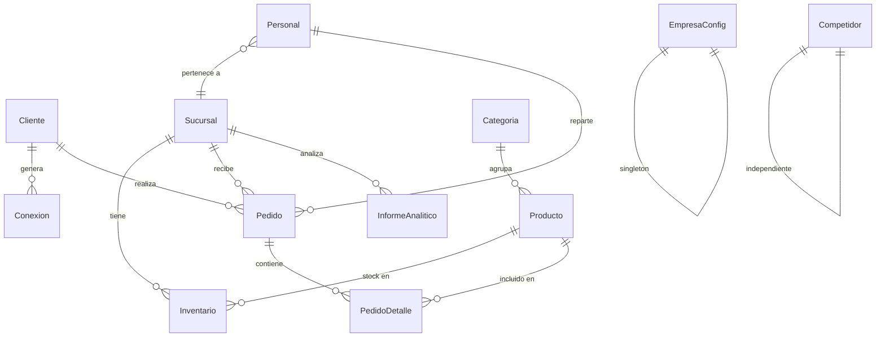

# 📋 Diagramas de Casos de Uso — Sistema Globy

---

## 1. Actores del Sistema

| Actor | Rol en el sistema | Acceso |
|---|---|---|
| **Administrador** (`admin`) | Control total del sistema. Gestiona personal, sucursales, productos, configuración y accede al módulo de IA (Globy). | Todas las páginas |
| **Gerente** (`gerente`) | Supervisión operativa. Ve estadísticas, clientes, ventas, entregas y accede al módulo de IA. | Dashboard, Productos, Ventas, Clientes, Estadísticas, Globy, Entregas, Notificaciones |
| **Trabajador** (`trabajador`) | Operaciones diarias: gestión de ventas/pedidos y visualización de productos. | Dashboard, Productos, Ventas, Notificaciones |
| **Delivery** (`delivery`) | Gestión de entregas: acepta pedidos, actualiza estados de envío. | Dashboard, Productos, Entregas, Notificaciones |
| **Cliente** | Usuario final externo. Se registra, inicia sesión, realiza pedidos, genera datos de geolocalización. | Portal/App del Cliente (pendiente) |

### Matriz de Permisos por Página

| Página | admin | gerente | trabajador | delivery |
|---|:---:|:---:|:---:|:---:|
| Dashboard | ✅ | ✅ | ✅ | ✅ |
| Productos | ✅ | ✅ | ✅ | ✅ |
| Ventas | ✅ | ✅ | ✅ | ❌ |
| Clientes | ✅ | ✅ | ❌ | ❌ |
| Estadísticas | ✅ | ✅ | ❌ | ❌ |
| Globy (IA) | ✅ | ✅ | ❌ | ❌ |
| Configuración | ✅ | ❌ | ❌ | ❌ |
| Usuarios | ✅ | ❌ | ❌ | ❌ |
| Entregas | ✅ | ✅ | ❌ | ✅ |
| Notificaciones | ✅ | ✅ | ✅ | ✅ |

---

## 2. Diagrama General de Casos de Uso

```mermaid
graph LR
    subgraph Actores
        ADM["🔑 Administrador"]
        GER["📊 Gerente"]
        TRB["🛒 Trabajador"]
        DEL["🚚 Delivery"]
        CLI["👤 Cliente"]
    end

    subgraph "Módulo: Autenticación"
        UC01["CU-01: Iniciar Sesión<br/>(Personal)"]
        UC02["CU-02: Iniciar Sesión<br/>(Cliente)"]
        UC03["CU-03: Registrar Cliente"]
    end

    subgraph "Módulo: Gestión de Sucursales"
        UC04["CU-04: Crear Sucursal"]
        UC05["CU-05: Listar Sucursales"]
        UC06["CU-06: Editar Sucursal"]
        UC07["CU-07: Ver Detalle Sucursal"]
    end

    subgraph "Módulo: Productos e Inventario"
        UC08["CU-08: Crear Producto"]
        UC09["CU-09: Listar Productos"]
        UC10["CU-10: Editar Producto"]
        UC11["CU-11: Consultar Inventario<br/>por Sucursal"]
        UC12["CU-12: Actualizar Stock"]
        UC13["CU-13: Ver Categorías"]
    end

    subgraph "Módulo: Gestión de Personal"
        UC14["CU-14: Registrar Personal"]
        UC15["CU-15: Listar Personal"]
        UC16["CU-16: Editar Personal"]
    end

    subgraph "Módulo: Clientes"
        UC17["CU-17: Ver Datos Cliente"]
        UC18["CU-18: Editar Perfil Cliente"]
    end

    subgraph "Módulo: Pedidos y Entregas"
        UC19["CU-19: Realizar Pedido"]
        UC20["CU-20: Ver Pedidos Disponibles"]
        UC21["CU-21: Aceptar Entrega"]
        UC22["CU-22: Actualizar Estado Pedido"]
    end

    subgraph "Módulo: Análisis con IA - Globy"
        UC23["CU-23: Generar Reporte<br/>Patrones de Ventas"]
        UC24["CU-24: Generar Reporte<br/>Zonas de Demanda"]
        UC25["CU-25: Generar Reporte<br/>Comportamiento"]
        UC26["CU-26: Ver Hot Spots<br/>(Mapa de Calor)"]
        UC27["CU-27: Descargar Reporte PDF"]
    end

    subgraph "Módulo: Configuración"
        UC28["CU-28: Configurar Empresa"]
        UC29["CU-29: Subir Logo"]
    end

    ADM --- UC01 & UC04 & UC05 & UC06 & UC07
    ADM --- UC08 & UC09 & UC10 & UC11 & UC12 & UC13
    ADM --- UC14 & UC15 & UC16
    ADM --- UC23 & UC24 & UC25 & UC26 & UC27
    ADM --- UC28 & UC29

    GER --- UC01 & UC05 & UC07
    GER --- UC09 & UC11 & UC13
    GER --- UC15
    GER --- UC17
    GER --- UC23 & UC24 & UC25 & UC26 & UC27

    TRB --- UC01 & UC09 & UC19

    DEL --- UC01 & UC20 & UC21 & UC22

    CLI --- UC02 & UC03 & UC18 & UC19
```

---

## 3. Descripción Detallada de Casos de Uso

### 📦 Módulo: Autenticación y Acceso

| ID | Caso de Uso | Actor(es) | Precondición | Flujo Principal | Postcondición |
|---|---|---|---|---|---|
| CU-01 | Iniciar Sesión (Personal) | Admin, Gerente, Trabajador, Delivery | Tener cuenta registrada y activa | 1. Ingresa correo y contraseña → 2. Sistema valida credenciales → 3. Genera JWT (24h) → 4. Redirige según rol | Usuario autenticado con token en sessionStorage |
| CU-02 | Iniciar Sesión (Cliente) | Cliente | Tener cuenta registrada | 1. Ingresa correo y contraseña → 2. Valida → 3. JWT → 4. Acceso al portal | Cliente autenticado |
| CU-03 | Registrar Cliente | Cliente | Ninguna | 1. Completa formulario (nombre, apellido, cédula, correo, password) → 2. Sistema valida unicidad de cédula y correo → 3. Crea registro | Cuenta creada con tipoCliente = "bronce" |

### 🏢 Módulo: Gestión de Sucursales

| ID | Caso de Uso | Actor(es) | Precondición | Flujo Principal | Postcondición |
|---|---|---|---|---|---|
| CU-04 | Crear Sucursal | Admin | Autenticado con rol admin | Ingresa nombre, ciudad, dirección, coordenadas (lat/lng), tipo → Sistema crea registro con status=true | Sucursal registrada en la base de datos |
| CU-05 | Listar Sucursales | Admin, Gerente | Autenticado | Sistema consulta todas las sucursales con conteo de personal e inventarios | Vista de lista actualizada |
| CU-06 | Editar Sucursal | Admin | Autenticado, sucursal existente | Selecciona sucursal → Modifica campos → Sistema actualiza | Datos de sucursal actualizados |
| CU-07 | Ver Detalle Sucursal | Admin, Gerente | Autenticado, sucursal existente | Selecciona sucursal → Sistema muestra datos + lista de personal asignado (id, nombre, apellido, rol) | Información detallada visible |

### 📦 Módulo: Productos e Inventario

| ID | Caso de Uso | Actor(es) | Precondición | Flujo Principal | Postcondición |
|---|---|---|---|---|---|
| CU-08 | Crear Producto | Admin | Autenticado, categoría existente | Ingresa nombre, tipo, descripción, precioBase, emailProveedor, categoriaId → Sistema crea producto vinculado a categoría | Producto registrado |
| CU-09 | Listar Productos | Todo el personal | Autenticado | Sistema retorna catálogo completo de productos | Lista de productos visible |
| CU-10 | Editar Producto | Admin | Autenticado, producto existente | Selecciona producto → Modifica campos (nombre, precio, etc.) → Sistema actualiza | Datos del producto actualizados |
| CU-11 | Consultar Inventario por Sucursal | Admin, Gerente | Autenticado, sucursal existente | Selecciona sucursal → Sistema muestra productos con su stock actual (incluye datos del producto) | Inventario de la sucursal visible |
| CU-12 | Actualizar Stock | Admin | Autenticado | Selecciona sucursal + producto + cantidad → Sistema ejecuta upsert en inventario | Stock actualizado o registro creado con stockMínimo=5 |
| CU-13 | Ver Categorías | Admin, Gerente | Autenticado | Sistema lista todas las categorías disponibles | Lista de categorías visible |

### 👥 Módulo: Gestión de Personal

| ID | Caso de Uso | Actor(es) | Precondición | Flujo Principal | Postcondición |
|---|---|---|---|---|---|
| CU-14 | Registrar Personal | Admin | Autenticado con rol admin | Ingresa nombre, apellido, cédula, correo, password, rol, sucursalId → Sistema crea usuario | Personal registrado con status=true |
| CU-15 | Listar Personal | Admin, Gerente | Autenticado | Sistema lista todo el personal con su sucursal asignada, ordenado por fecha de creación descendente | Lista de personal visible |
| CU-16 | Editar Personal | Admin | Autenticado, personal existente | Selecciona personal → Modifica rol, status, sucursal asignada → Sistema actualiza | Datos del personal actualizados |

### 👤 Módulo: Gestión de Clientes (Vista administrativa)

| ID | Caso de Uso | Actor(es) | Precondición | Flujo Principal | Postcondición |
|---|---|---|---|---|---|
| CU-17 | Ver Datos de un Cliente | Admin, Gerente | Autenticado | Selecciona cliente por ID → Sistema retorna datos (sin password) | Información del cliente visible |
| CU-18 | Editar Perfil del Cliente | Cliente (desde su portal) | Autenticado como cliente | Modifica sus datos personales (dirección, etc.) → Sistema actualiza | Perfil actualizado |

### 🚚 Módulo: Pedidos y Entregas

| ID | Caso de Uso | Actor(es) | Precondición | Flujo Principal | Postcondición | Estado |
|---|---|---|---|---|---|---|
| CU-19 | Realizar Pedido | Cliente, Trabajador | Autenticado, productos disponibles | Selecciona productos → Especifica cantidades → Crea pedido con detalles → Status "pendiente" | Pedido creado con total calculado | ⚠️ Backend pendiente |
| CU-20 | Ver Pedidos Disponibles | Delivery | Autenticado con rol delivery | Sistema lista pedidos con status=preparado y sin repartidor asignado | Lista de pedidos disponibles | ⚠️ Backend pendiente |
| CU-21 | Aceptar Entrega | Delivery | Autenticado, pedido disponible | Selecciona pedido → Sistema asigna repartidorId del JWT | Pedido asignado al delivery | ⚠️ Backend pendiente |
| CU-22 | Actualizar Estado del Pedido | Delivery | Autenticado, pedido asignado | Cambia status: preparado → en_camino → entregado | Estado del pedido actualizado | ⚠️ Backend pendiente |

### 🤖 Módulo: Análisis con IA (Globy)

| ID | Caso de Uso | Actor(es) | Precondición | Flujo Principal | Postcondición |
|---|---|---|---|---|---|
| CU-23 | Generar Reporte de Patrones de Ventas | Admin, Gerente | Autenticado, datos de ventas existentes | Solicita análisis → Backend cruza datos de Pedido + PedidoDetalle + Producto → IA procesa → Genera PDF | InformeAnalitico persistido + PDF disponible |
| CU-24 | Generar Reporte de Zonas de Demanda | Admin, Gerente | Autenticado, datos de conexiones existentes | Solicita → Cruza datos de Conexion + Cliente + Competidor → IA identifica clusters geográficos → Genera PDF | Reporte con zonas de oportunidad |
| CU-25 | Generar Reporte de Comportamiento | Admin, Gerente | Autenticado, datos de clientes existentes | Solicita → Analiza hábitos de compra y frecuencia → IA genera insights → Genera PDF | Reporte de segmentación de clientes |
| CU-26 | Ver Hot Spots (Mapa de Calor) | Admin, Gerente | Autenticado | Abre sección de mapa → Sistema obtiene datos de conexiones + competidores → Renderiza mapa con zonas de calor | Mapa interactivo visible |
| CU-27 | Descargar Reporte Generado | Admin, Gerente | Autenticado, reporte existente | Selecciona reporte de la lista → Descarga archivo PDF | Archivo PDF descargado |

### ⚙️ Módulo: Configuración del Sistema

| ID | Caso de Uso | Actor(es) | Precondición | Flujo Principal | Postcondición |
|---|---|---|---|---|---|
| CU-28 | Configurar Datos de Empresa | Admin | Autenticado con rol admin | Edita nombreEmpresa, rif, direcciónFiscal, teléfono, moneda, configuración SMTP → Sistema guarda (upsert) | Configuración global actualizada |
| CU-29 | Subir Logo de la Empresa | Admin | Autenticado con rol admin | Selecciona imagen (jpg/png/webp, máx 5MB) → Multer procesa y almacena → Sistema retorna URL pública | Logo accesible en /uploads/ |

---

## 4. Modelo de Datos Resumido (Entidad-Relación)

