# 📊 Diagramas de Actividades — Sistema Globy

## Actor: Administrador (admin)

El Administrador tiene acceso completo a todos los módulos del sistema.

---

### DA-ADM-01: Iniciar Sesión

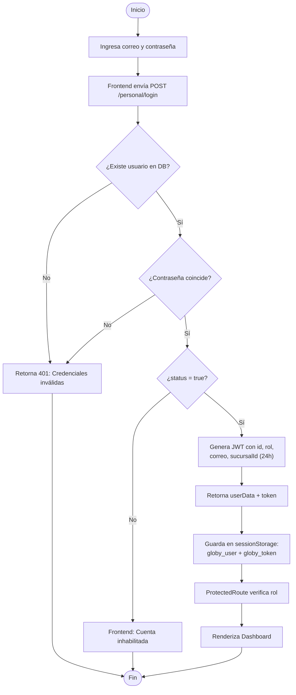

---

### DA-ADM-02: Registrar Personal

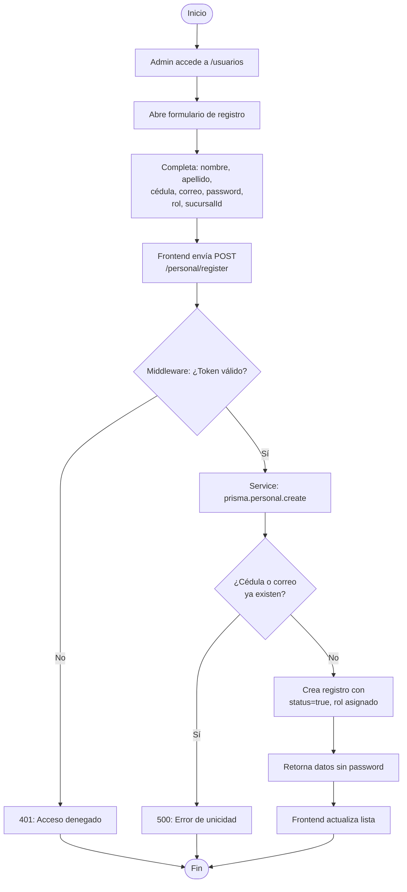

---

### DA-ADM-03: Listar Personal

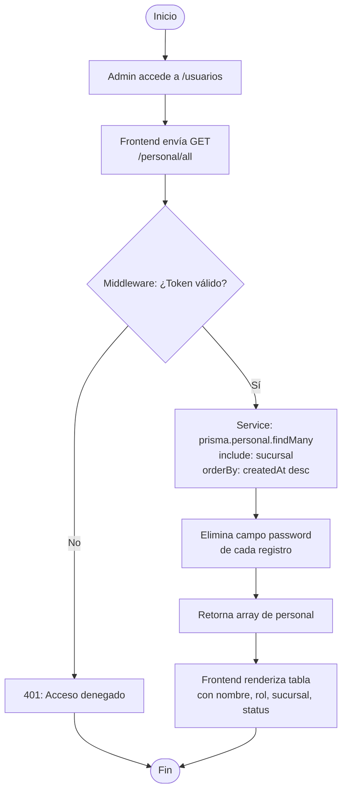

---

### DA-ADM-04: Editar Personal

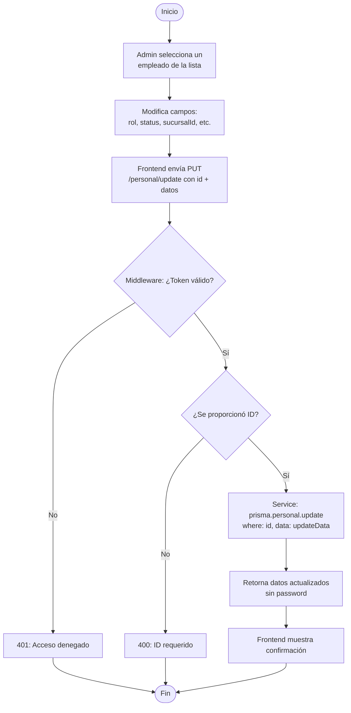

---

### DA-ADM-05: Crear Sucursal

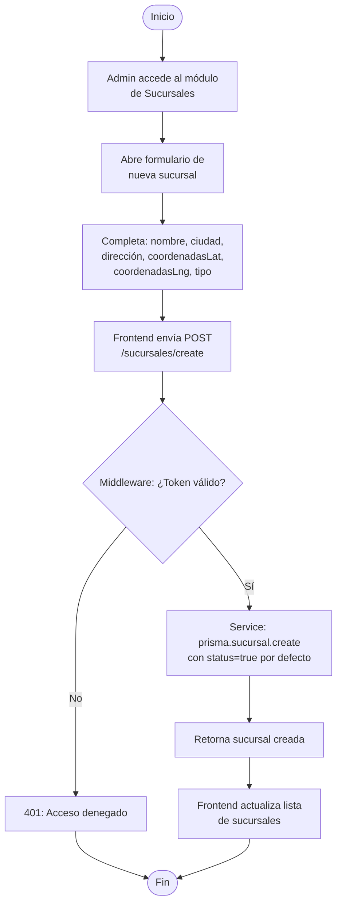

---

### DA-ADM-06: Listar Sucursales

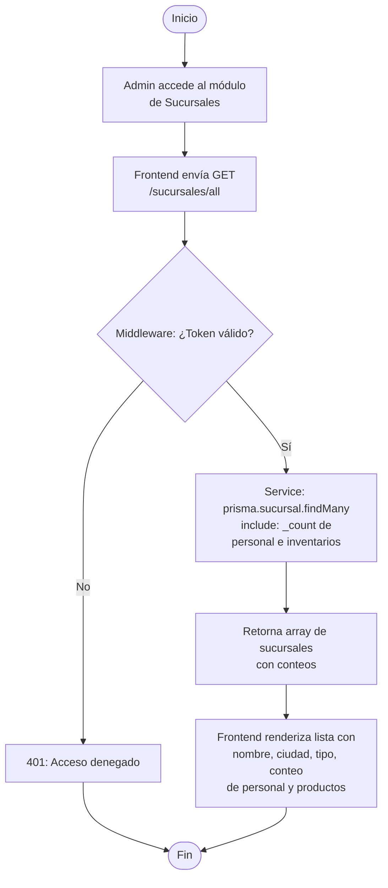

---

### DA-ADM-07: Editar Sucursal

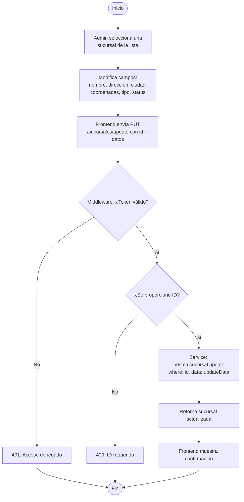

---

### DA-ADM-08: Ver Detalle de Sucursal

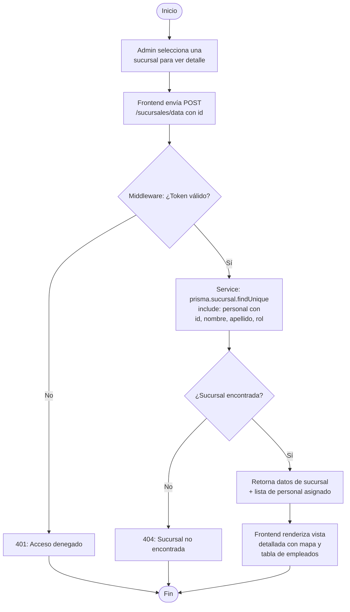

---

### DA-ADM-09: Crear Producto

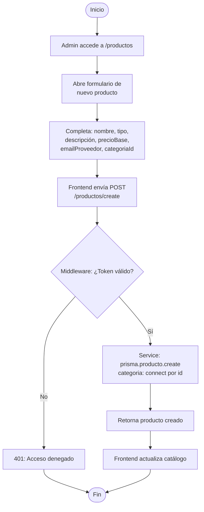

---

### DA-ADM-10: Listar Productos

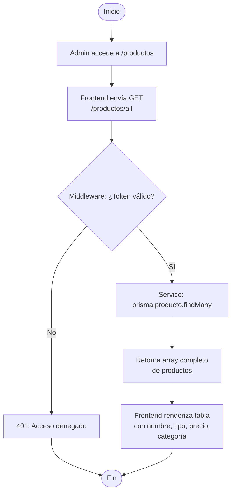

---

### DA-ADM-11: Editar Producto

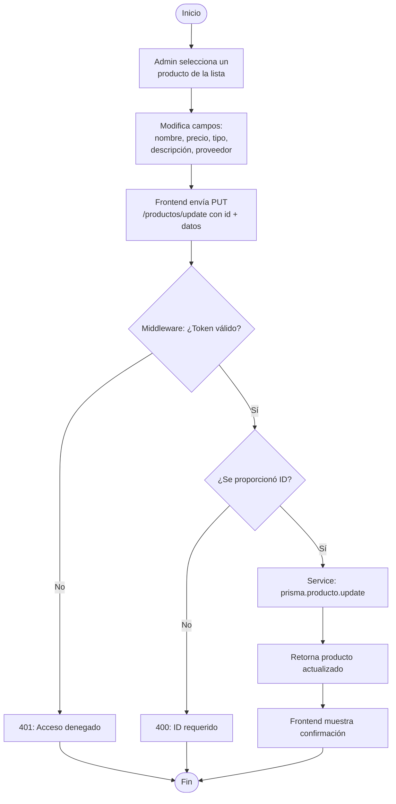

---

### DA-ADM-12: Consultar Inventario por Sucursal

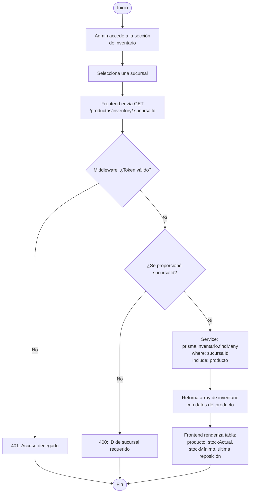

---

### DA-ADM-13: Actualizar Stock

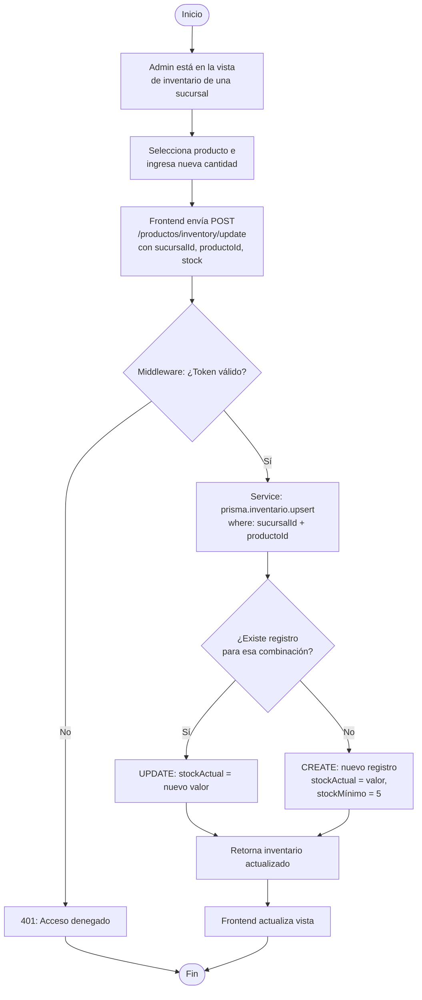

---

### DA-ADM-14: Ver Categorías

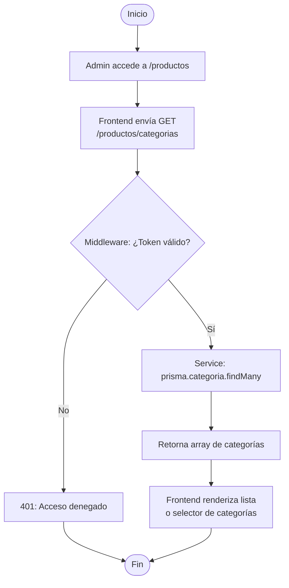

---

### DA-ADM-15: Configurar Datos de la Empresa

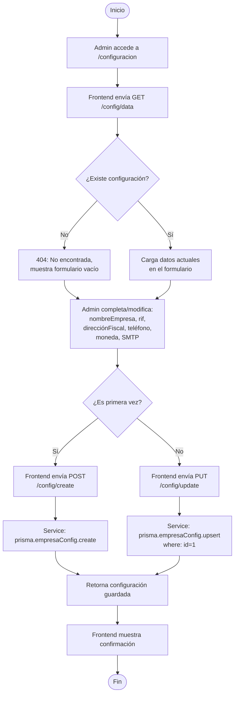

---

### DA-ADM-16: Subir Logo de la Empresa

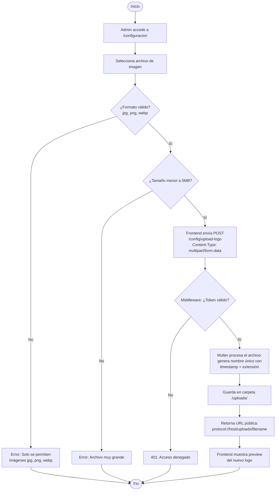

---

### DA-ADM-17: Generar Reporte de Patrones de Ventas

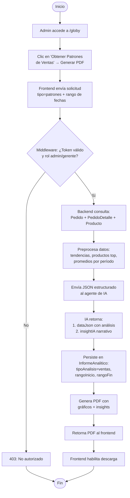

---

### DA-ADM-18: Generar Reporte de Zonas de Demanda

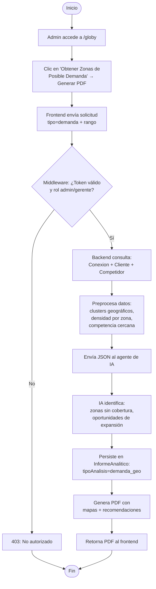

---

### DA-ADM-19: Generar Reporte de Comportamiento

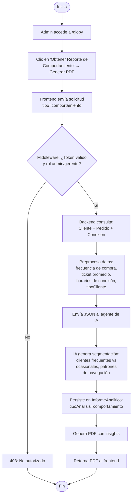

---

### DA-ADM-20: Ver Mapa de Calor (Hot Spots)

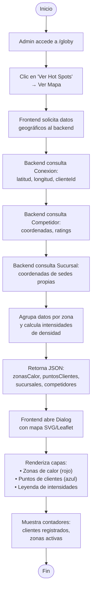

---

### DA-ADM-21: Descargar Reporte PDF Generado

```mermaid
flowchart TD
    A([Inicio]) --> B[Admin accede a /globy]
    B --> C["Ve la sección<br/>'Reportes Generados'"]
    C --> D["Frontend lista reportes:<br/>nombre, tipo, fecha, tamaño"]
    D --> E[Admin selecciona un reporte]
    E --> F["Clic en botón de descarga"]
    F --> G["Frontend solicita archivo<br/>al backend por ID"]
    G --> H{¿Reporte existe?}
    H -- No --> I[404: Reporte no encontrado]
    I --> J([Fin])
    H -- Sí --> K[Backend retorna archivo PDF]
    K --> L[Navegador descarga el PDF]
    L --> J
```

---

### DA-ADM-22: Ver Dashboard General

```mermaid
flowchart TD
    A([Inicio]) --> B["Admin accede a / (Dashboard)"]
    B --> C["Frontend solicita datos<br/>consolidados al backend"]
    C --> D["Backend consulta en paralelo:<br/>• Total ventas del mes<br/>• Conteo productos activos<br/>• Pedidos del día<br/>• Clientes nuevos"]
    D --> E["Backend consulta ventas<br/>mensuales para gráfico<br/>de tendencia"]
    E --> F["Backend consulta top 5<br/>productos más vendidos"]
    F --> G["Backend consulta distribución<br/>de clientes por ciudad"]
    G --> H["Backend consulta productos<br/>con stock bajo<br/>(stockActual menor stockMínimo)"]
    H --> I["Backend consulta<br/>ventas recientes"]
    I --> J["Retorna JSON consolidado<br/>al frontend"]
    J --> K["Frontend renderiza:<br/>• 4 tarjetas de resumen<br/>• Gráfico de tendencia<br/>• Pie chart ciudades<br/>• Top productos<br/>• Alertas stock bajo<br/>• Ventas recientes"]
    K --> L([Fin])
```

---

### DA-ADM-23: Ver Estadísticas Detalladas

```mermaid
flowchart TD
    A([Inicio]) --> B[Admin accede a /estadisticas]
    B --> C["Frontend solicita datos<br/>estadísticos al backend"]
    C --> D["Backend procesa datos por<br/>4 dimensiones"]
    D --> E["Tab Ventas:<br/>• Tendencia mensual<br/>• Ventas por tamaño<br/>• Producto más vendido<br/>por categoría"]
    D --> F["Tab Productos:<br/>• Top 5 más vendidos<br/>• Gráfico de barras<br/>con ingresos por producto"]
    D --> G["Tab Clientes:<br/>• Top clientes por compras<br/>• Clientes nuevos por mes<br/>• Gráfico de líneas"]
    D --> H["Tab Ciudades:<br/>• Distribución por ciudad<br/>• Ventas por zona<br/>• Tabla resumen"]
    E --> I["Retorna JSON con<br/>todos los datasets"]
    F --> I
    G --> I
    H --> I
    I --> J["Frontend renderiza con<br/>Recharts: AreaChart, BarChart,<br/>PieChart, LineChart, Table"]
    J --> K["Admin navega entre tabs<br/>para explorar datos"]
    K --> L([Fin])
```

---

### DA-ADM-24: Ver Lista de Clientes

```mermaid
flowchart TD
    A([Inicio]) --> B[Admin accede a /clientes]
    B --> C["Frontend solicita lista<br/>de clientes al backend"]
    C --> D{Middleware: ¿Token válido?}
    D -- No --> E[401: Acceso denegado]
    E --> F([Fin])
    D -- Sí --> G["Backend consulta todos<br/>los clientes registrados"]
    G --> H["Retorna datos sin password:<br/>nombre, apellido, cédula,<br/>correo, dirección, tipoCliente"]
    H --> I["Frontend renderiza tabla<br/>con filtros y búsqueda"]
    I --> J{¿Admin selecciona<br/>un cliente?}
    J -- No --> F
    J -- Sí --> K["Muestra detalle:<br/>datos personales,<br/>historial de pedidos,<br/>conexiones registradas"]
    K --> F
```

---

### DA-ADM-25: Gestionar Entregas (Vista Admin)

```mermaid
flowchart TD
    A([Inicio]) --> B[Admin accede a /entregas]
    B --> C["Frontend solicita:<br/>GET /pedidos/available<br/>GET /pedidos/mine"]
    C --> D["Tab 'Disponibles':<br/>Lista pedidos sin<br/>repartidor asignado"]
    C --> E["Tab 'Mis Entregas':<br/>Lista pedidos asignados<br/>al personal"]
    D --> F{¿Admin asigna<br/>un pedido?}
    F -- Sí --> G["POST /pedidos/:id/assign"]
    G --> H[Pedido asignado al admin]
    F -- No --> I[Supervisa el estado]
    E --> J{¿Actualiza estado?}
    J -- preparado --> K["PUT status = en_camino"]
    J -- en_camino --> L["PUT status = entregado"]
    J -- No --> I
    K --> I
    L --> I
    H --> I
    I --> M([Fin])
```
