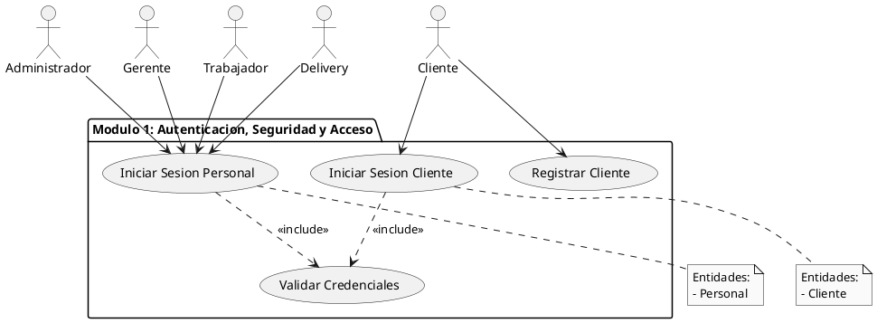
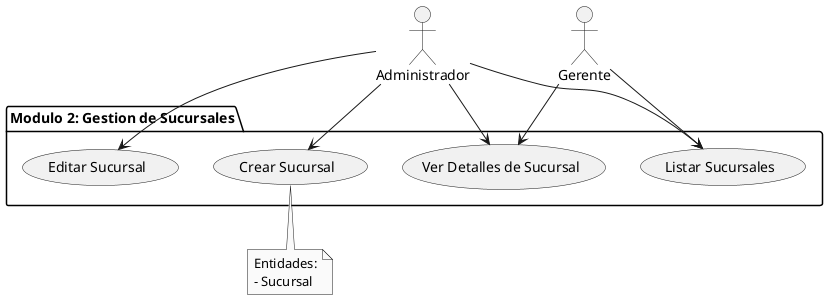
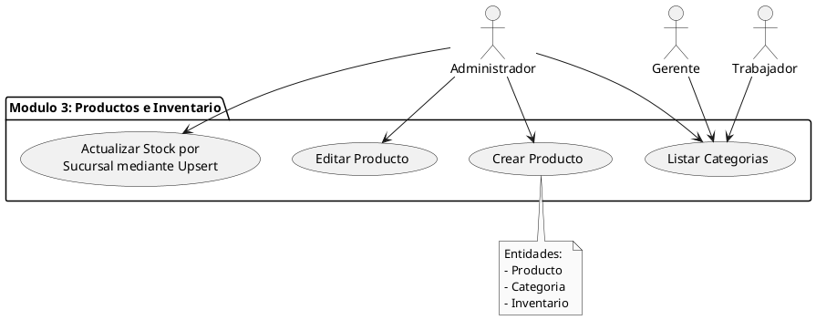
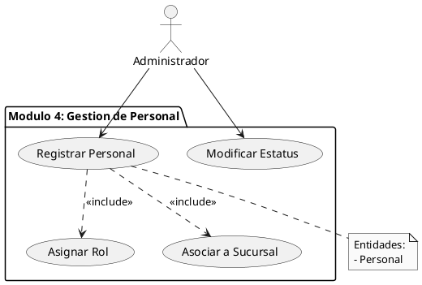
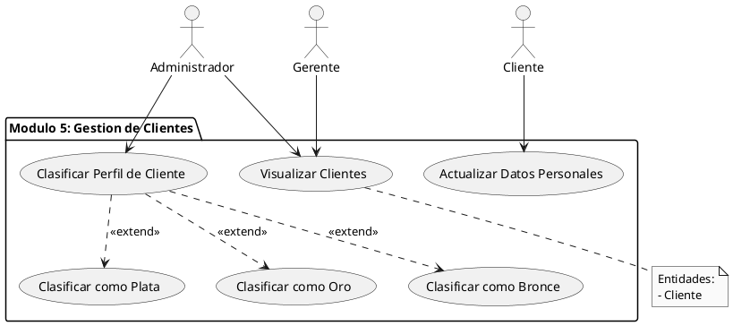
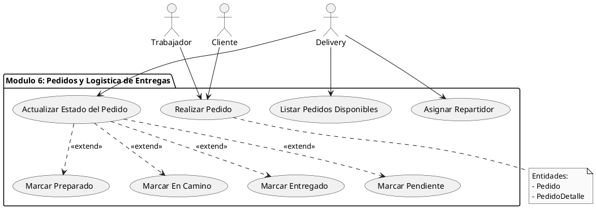
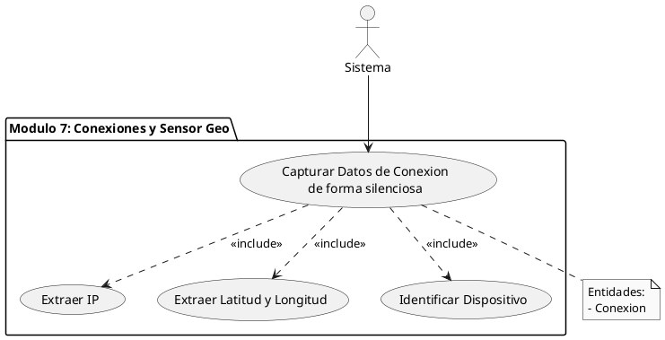
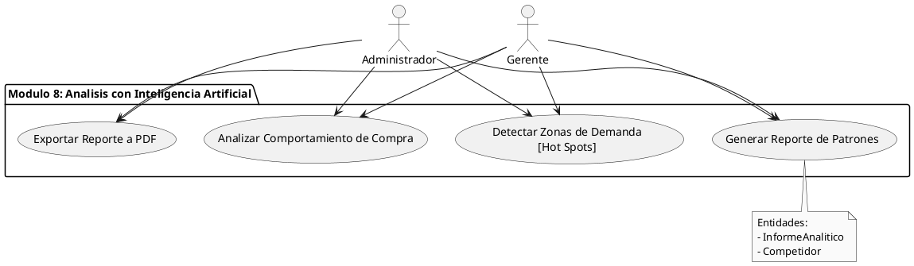
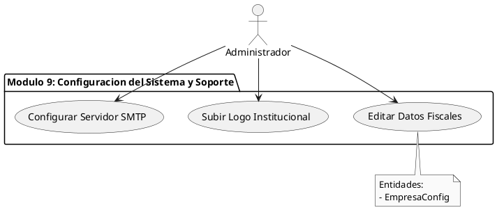

# 📋 Diagramas de Casos de Uso por Módulo — Sistema Globy

> **Nota para la UNERG:** Este documento contiene la especificación funcional en notación UML 2.5 pura utilizando PlantUML. Se han incorporado las directivas `skinparam actorStyle stickman` y `skinparam monochrome true` para renderizar el diagrama estrictamente en formato académico y se han definido correctamente las fronteras del sistema (`package`).

A continuación, se presentan los bloques de código PlantUML separados por módulo. Puedes copiarlos y pegarlos directamente en [PlantText](https://www.planttext.com/) o en tu IDE.

## Módulo 1: Autenticación, Seguridad y Acceso

## Módulo 2: Gestión de Sucursales

## Módulo 3: Productos e Inventario

## Módulo 4: Gestión de Personal

## Módulo 5: Gestión de Clientes

## Módulo 6: Pedidos y Logística de Entregas

## Módulo 7: Conexiones y Sensor Geo

## Módulo 8: Análisis con Inteligencia Artificial (Globy)

## Módulo 9: Configuración del Sistema y Soporte

